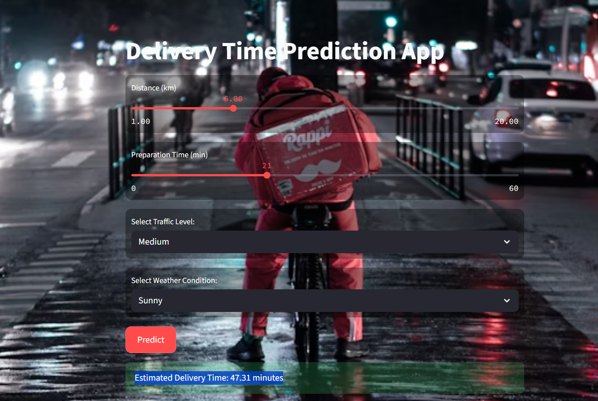
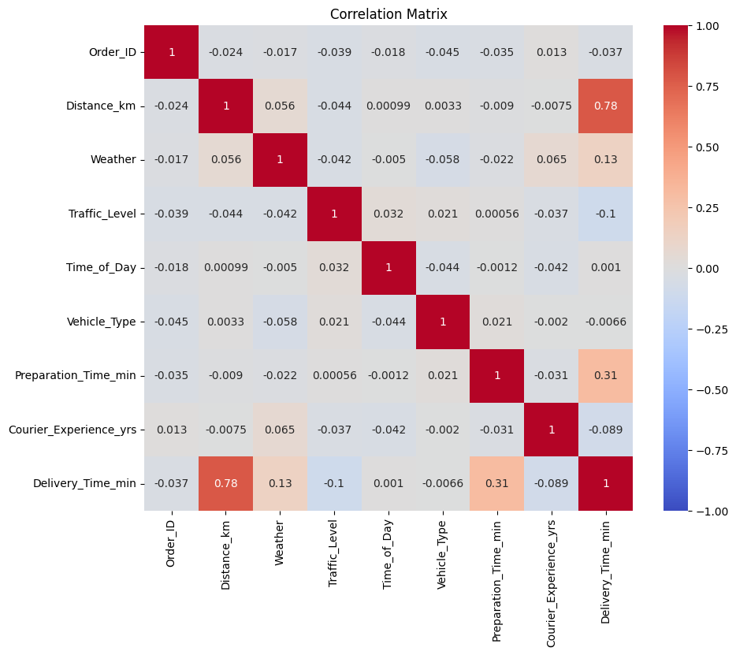
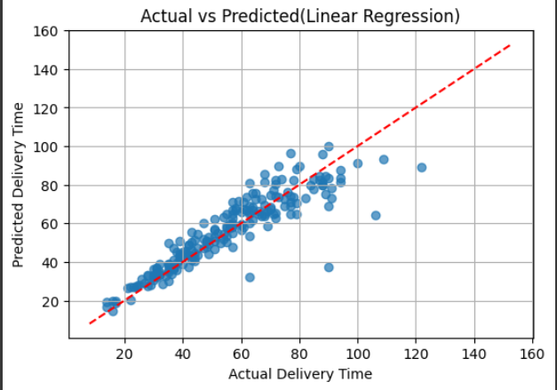

# Food Delivery Time Prediction

This project presents a regression-based solution to predict **food delivery time** in minutes using real-world features like distance, traffic, weather, and preparation time.

---

## 📸 App Preview

---

## 🎯 Objective

To accurately predict delivery time and help food delivery services optimize logistics and improve customer experience.

## 📂 Dataset

- Source: Kaggle
- Key Features:
  - Distance_km
  - Preparation_Time_min
  - Weather (encoded)
  - Traffic_Level (encoded)
- Target: Delivery_Time_min

---

## 🔍 Data Preparation

- Missing values handled using:
  - Mode for categorical
- Outliers removed from:
  - Distance_km
  - Preparation_Time_min
  - Delivery_Time_min (IQR method)

- Used Label Encoding to inspect correlation matrix:
  

- Then applied One-Hot Encoding (get_dummies) before modeling to avoid implicit priority to category values.

---

## 📊 Feature Insights

- `Distance_km` has strong positive correlation with delivery time.
- `Traffic_Level_Low` strongly reduces expected delivery time.
- Weather conditions like `Snowy` and `Foggy` significantly increase delays.

.png)

---

## 📈 Model Training & Evaluation

We tested the following regression models:

### Linear Regression
- MAE: **6.0984**
- MSE: **79.7831**
- RMSE: **8.9321**
- R² Score: **0.822**
- Adjusted R²: **0.8145**

### Ridge Regression
- MAE: 6.1055
- MSE: 80.0719
- RMSE: 8.9483
- R² Score: 0.8214
- Adjusted R²: 0.8139

### Lasso Regression
- MAE: 6.2275
- MSE: 84.0258
- RMSE: 9.1666
- R² Score: 0.8125
- Adjusted R²: 0.8047

#### ✅ We chose **Linear Regression** for final deployment as it achieved the best performance across all metrics with the least complexity.

### Actual vs Predicted:

| Model | Plot |
|-------|------|
| Linear |  |
| Ridge  | .png) |
| Lasso  | .png) |

---

## 📈 Delivery Time vs Data columns

.png)

---

## 🚀 Deployment

Live app hosted with Gradio on Hugging Face Spaces.

🔗 Try it here: [Live App](https://huggingface.co/spaces/abdelrhman145/food_delivery_time_prediction)

---

## 🛠️ Tools Used

- Python
- Pandas, NumPy
- Seaborn, Matplotlib
- Scikit-learn
- Streamlit + Hugging Face Spaces
